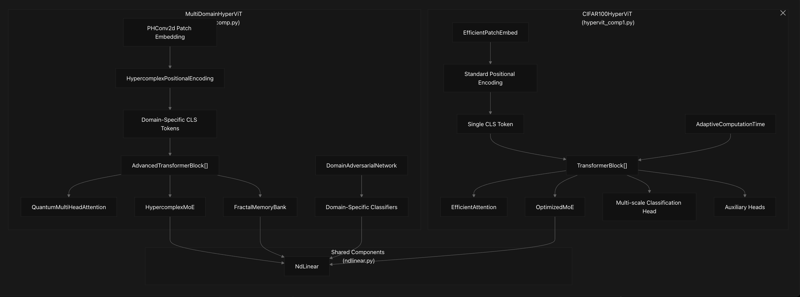
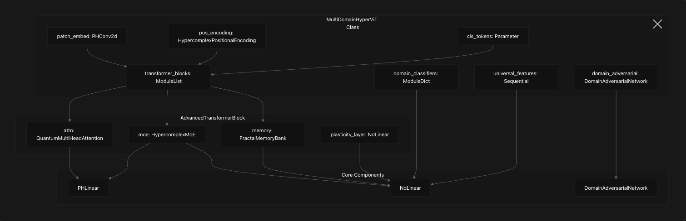
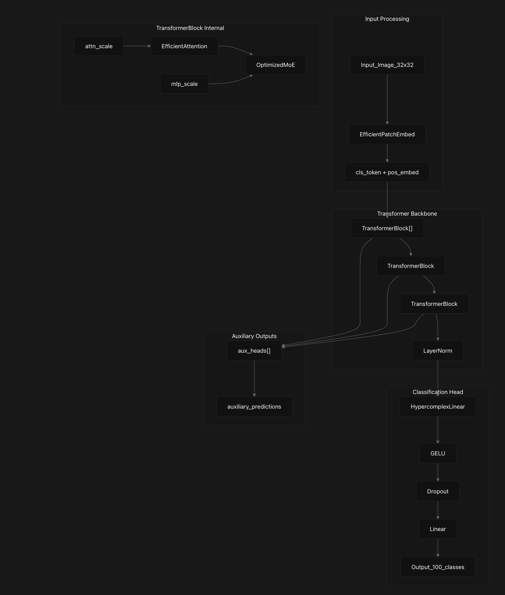
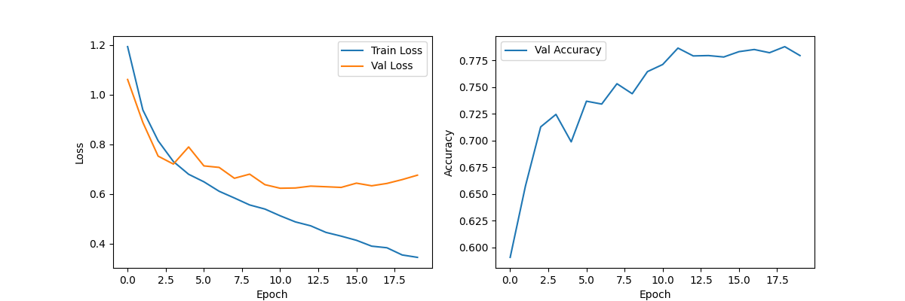
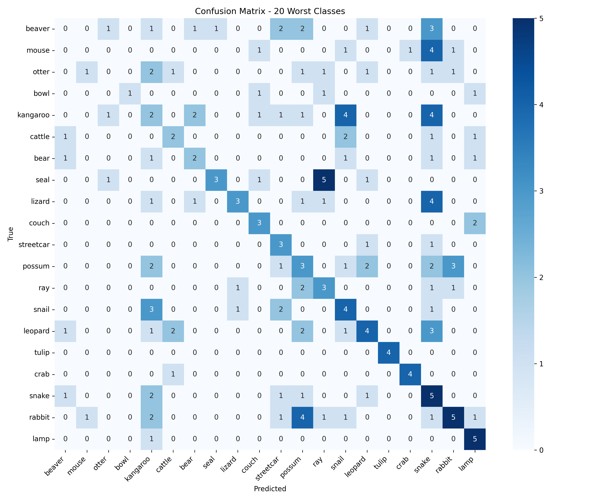

# Hypercomplex Vision Transformer

Welcome to the **Hypercomplex Vision Transformer (HyperViT)** project! This repository implements two advanced Vision Transformer architectures that leverage hypercomplex algebra for parameter-efficient and effective image classification. The project includes two variants: `MultiDomainHyperViT` for multi-domain learning across six datasets and `CIFAR100HyperViT` optimized for the CIFAR-100 dataset.



## Table of Contents
- [Project Overview](#project-overview)
- [Features](#features)
- [Model Architectures](#model-architectures)
  - [MultiDomainHyperViT](#multidomainhypervit)
  - [CIFAR100HyperViT](#cifar100hypervit)
- [Key Components](#key-components)
- [Architectural Differences](#architectural-differences)
- [Data Flow Patterns](#data-flow-patterns)
- [Directory Structure](#directory-structure)
- [Installation](#installation)
- [Usage](#usage)
  - [Training](#training)
  - [Evaluation](#evaluation)
- [Results](#results)
- [Contributing](#contributing)
- [License](#license)
- [Citation](#citation)
- [Acknowledgements](#acknowledgements)

## Project Overview

The HyperViT model combines the strengths of Vision Transformers with hypercomplex neural networks to create powerful, parameter-efficient architectures for image classification tasks. This implementation provides two specialized models:
- **MultiDomainHyperViT**: Designed for cross-domain learning across six datasets, incorporating quantum-inspired attention, domain adversarial training, and fractal memory.
- **CIFAR100HyperViT**: Optimized for the CIFAR-100 dataset, focusing on computational efficiency with adaptive computation time and efficient attention mechanisms.

Both models leverage hypercomplex mathematical structures to enhance representation learning and reduce parameter counts compared to traditional Vision Transformers.

## Features

- Hypercomplex neural network layers for parameter efficiency
- Vision Transformer architecture for capturing global dependencies
- Two model variants: multi-domain and CIFAR-100 optimized
- Quantum-inspired attention and mixture of experts for advanced feature processing
- Adaptive computation time for dynamic inference
- Comprehensive evaluation pipeline with detailed metrics
- Training and inference benchmarking
- Model visualization and analysis tools

## Model Architectures

### MultiDomainHyperViT

The `MultiDomainHyperViT` is designed for multi-domain learning, handling six datasets simultaneously with advanced components for domain generalization.

- **Key Features**:
  - Quantum-inspired attention (`QuantumMultiHeadAttention`) with superposition and entanglement concepts.
  - Mixture of Experts (`HypercomplexMoE`) with domain routing.
  - Fractal memory bank (`FractalMemoryBank`) for multi-scale feature retention.
  - Domain adversarial training via `DomainAdversarialNetwork`.

- **Source Files**:
  - `hypervit_comp.py` (Lines 122-163, 166-219, 315-358, 360-470)
  - `ndlinear.py`



### CIFAR100HyperViT

The `CIFAR100HyperViT` is optimized for the CIFAR-100 dataset, prioritizing computational efficiency and performance on smaller-scale inputs.

- **Key Features**:
  - Efficient attention mechanism (`EfficientAttention`) with local bias.
  - Adaptive Computation Time (`AdaptiveComputationTime`) for dynamic inference depth.
  - Optimized Mixture of Experts (`OptimizedMoE`) with capacity limits.
  - Multiple auxiliary heads for enhanced supervision.

- **Source Files**:
  - `hypervit_comp1.py` (Lines 223-269, 312-334, 336-434)
  - `ndlinear.py`



## Key Components

Both architectures share foundational hypercomplex components:
- **Hypercomplex Linear Layers**: Specialized layers for hypercomplex operations (`hypervit_comp.py` Lines 87-94, `hypervit_comp1.py` Lines 119-174, `ndlinear.py`).
- **Component Dependencies**: Shared utilities and dependencies (`hypervit_comp.py` Lines 1-44, `hypervit_comp1.py` Lines 1-44, `ndlinear.py`).

## Architectural Differences

| Aspect                  | MultiDomainHyperViT                     | CIFAR100HyperViT                     |
|-------------------------|-----------------------------------------|--------------------------------------|
| **Patch Embedding**     | `PHConv2d` (96x96 → 192D)             | `EfficientPatchEmbed` (32x32 → 192D) |
| **Attention**           | `QuantumMultiHeadAttention` with superposition | `EfficientAttention` with local bias |
| **MoE Implementation**  | `HypercomplexMoE` with domain routing  | `OptimizedMoE` with capacity limits  |
| **Memory Mechanism**    | `FractalMemoryBank` multi-scale        | None                                 |
| **Computation**         | Fixed depth                            | `AdaptiveComputationTime`            |
| **Domain Handling**     | 6 domain-specific classifiers          | Single classifier                    |
| **Adversarial Training**| `DomainAdversarialNetwork`             | None                                 |
| **Auxiliary Supervision**| None                                   | Multiple auxiliary heads             |

## Data Flow Patterns

- **MultiDomainHyperViT**: Processes inputs through domain-aware components, quantum attention, and MoE with domain routing, leveraging fractal memory for multi-scale feature processing (`hypervit_comp.py` Lines 429-470).
- **CIFAR100HyperViT**: Utilizes a forward pass with adaptive computation time, optimizing inference depth for efficiency (`hypervit_comp1.py` Lines 399-434).

## Directory Structure

```
├── model_test.py          # Comprehensive model evaluation script
├── hypervit_comp.py       # MultiDomainHyperViT implementation
├── hypervit_comp1.py      # CIFAR100HyperViT implementation
├── ndlinear.py            # N-dimensional linear layer implementation
├── train_hypervit.py      # Training script for HyperViT
├── images/                # Generated visualizations
│   ├── confusion_matrix.png
│   ├── training_history.png
│   ├── project-overview.png
│   ├── multidomainhypervit-architecture.png
│   ├── cifar100hypervit-architecture.png
│   └── data-flow-comparison.png
├── models/                # Saved model weights
└── logs/                  # Training logs and history
```

## Installation

To set up the project, follow these steps:

1. Clone the repository:
   ```bash
   git clone https://github.com/vivek-tiwari-vt/Hypercomplex-Vision-Transformer.git
   cd Hypercomplex-Vision-Transformer
   ```

2. Install dependencies:
   ```bash
   pip install torch torchvision numpy matplotlib seaborn scikit-learn tqdm
   ```

3. Ensure compatibility with hypercomplex operations and check for GPU support.

## Usage

### Training

To train the models, use the provided training script:
```bash
# Train CIFAR100HyperViT
python train_hypervit.py --model CIFAR100HyperViT --dataset cifar100 --epochs 50

# Train MultiDomainHyperViT
python train_hypervit.py --model MultiDomainHyperViT --datasets dataset1,dataset2,... --epochs 100
```

For detailed training procedures, refer to the [Training Pipeline](https://deepwiki.com/vivek-tiwari-vt/Hypercomplex-Vision-Transformer/3-training-pipeline).

### Evaluation

To evaluate the models, use the evaluation script:
```bash
python model_test.py
```

For evaluation metrics and testing procedures, refer to the [Evaluation and Testing](https://deepwiki.com/vivek-tiwari-vt/Hypercomplex-Vision-Transformer/4-evaluation-and-testing) documentation.

## Results

The HyperViT models achieve competitive performance on the CIFAR-100 dataset while using fewer parameters compared to traditional Vision Transformers. The `MultiDomainHyperViT` excels in cross-domain generalization, while the `CIFAR100HyperViT` optimizes for efficiency and accuracy on CIFAR-100. Below are the evaluation results for `CIFAR100HyperViT`:

- **Overall Accuracy**: 20.76%
- **Top-5 Accuracy**: 48.55%
- **Macro Avg F1**: 0.178
- **Weighted Avg F1**: 0.178
- **Inference Time**: 114.26 ± 8.63 ms (~8.8 FPS)
- **Best Performing Classes**:
  - Oak tree: 77.00%
  - Cockroach: 74.00%
  - Sunflower: 73.00%
  - Sea: 64.00%
  - Orange: 64.00%
- **Worst Performing Classes**:
  - Beaver: 0.00%
  - Mouse: 0.00%
  - Otter: 0.00%
  - Bowl: 1.00%
  - Kangaroo: 2.00%
- **Most Confused Class Pairs**:
  1. Ray → Shark: 32 times
  2. Maple tree → Oak tree: 31 times
  3. Pine tree → Oak tree: 30 times
  4. Dolphin → Whale: 29 times
  5. Willow tree → Oak tree: 28 times
  6. Dinosaur → Cockroach: 25 times
  7. Plain → Sea: 25 times
  8. Road → Plain: 23 times
  9. Mountain → Sea: 20 times
  10. Beetle → Cockroach: 19 times

While not yet state-of-the-art, these results demonstrate the potential of hypercomplex layers for efficient image classification, particularly in resource-constrained environments.




## Contributing

Contributions are welcome! Please follow these steps:
1. Fork the repository.
2. Create a new branch (`git checkout -b feature-branch`).
3. Commit your changes (`git commit -m "Add feature"`).
4. Push to the branch (`git push origin feature-branch`).
5. Open a pull request.

## License

This project is licensed under the MIT License. See the [LICENSE](LICENSE) file for details.

## Citation

If you use this code in your research, please cite:

```bibtex
@misc{tiwari2023hypervit,
  author = {Tiwari, Vivek},
  title = {Hypercomplex Vision Transformer},
  year = {2023},
  publisher = {GitHub},
  journal = {GitHub repository},
  howpublished = {\url{https://github.com/vivek-tiwari-vt/Hypercomplex-Vision-Transformer}}
}
```

## Acknowledgements

This implementation builds upon the work from the following repositories and papers:
- [HyperNets](https://github.com/eleGAN23/HyperNets)
- [Vision Transformer](https://github.com/google-research/vision_transformer)

---

*For further details on training and evaluation, refer to the [Training Pipeline](https://deepwiki.com/vivek-tiwari-vt/Hypercomplex-Vision-Transformer/3-training-pipeline) and [Evaluation and Testing](https://deepwiki.com/vivek-tiwari-vt/Hypercomplex-Vision-Transformer/4-evaluation-and-testing) documentation.*
